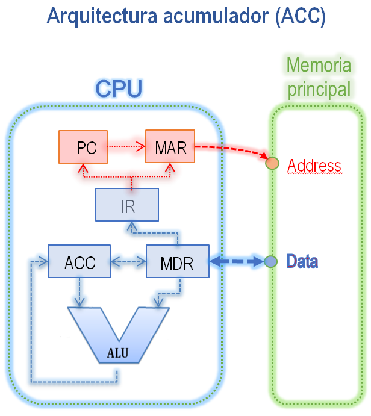
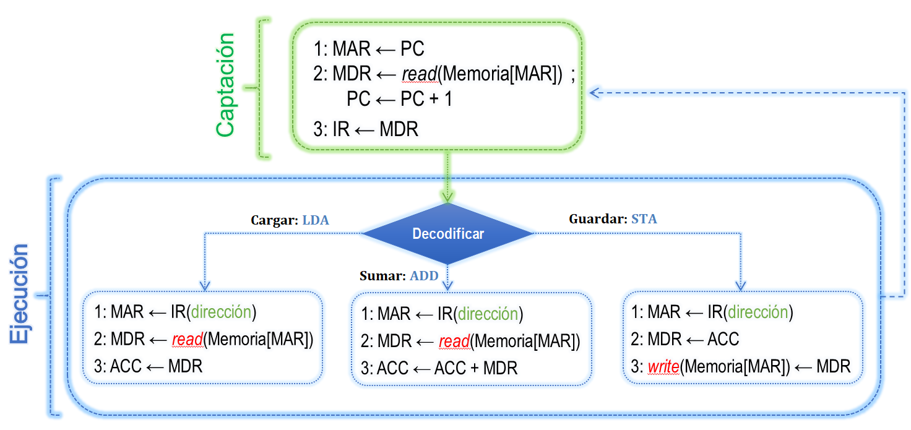

##  Semana 4: Aprender Arquitectura programando!! (Idea: Christiam Gregorio Rey Pacheco)

Objetivo: comprender como funcionamiento de la arquitectura acumulador (programando)

## Tabla de contenido

* [Arquitectura Acumulador](#Arquitectura_Acumulador)
* [Usando ensamblador](#Usando_ensamblador)
   * [Repertorio de instrucciones](#Repertorio_de_instrucciones)
      * [Instrucciones implementadas](#Instrucciones_implementadas)
   * [Comentarios](#comentarios)
   * [Etiquetas](#etiquetas)
   * [Espacio en blanco](#Espacio_en_blanco)
* [Ejecutar código](#Ejecutar_código)
* [Para hacer](#Para_hacer)
    * [Ciclos instrucciones](#Ciclos_instrucciones)


## Arquitectura_Acumulador 

En base EaterEmulator emulates [Ben Eater's](https://www.youtube.com/channel/UCS0N5baNlQWJCUrhCEo8WlA) trabajaremos con python para aprender la arquitectura acumulador de 8 bits.
La CPU procesa datos de 1 byte (8 bits), puede acceder solo 64 bytes de RAM, por lo tanto, el programa debe caber en 64 bytes y esto incluye cualquier variable que utilice.
La arquitectura del CPU permite gestionar un bus de direcciones de 6 bits = 2**6 = 64 posiciones y cada posicion de memoria contiene un 1 byte. El bus de datos de 8 bits (1 byte).
La implementación del cpu de Ben Eater:
https://youtube.com/c/BenEater
Hecha en Python se copio descaradamente de este link:
https://github.com/jaychandra86/EaterEmulator

En la **[Semana 3](/semana3/README.md)** se desarrollo los componentes de la arquitectura acumulador:



## Usando_ensamblador

Este proyecto incluye un Ensamblador que admite algunas de las capacidades estándar que esperaría encontrar en un ensamblador.

Cree un archivo .asm y escriba su programa en ensamblador. 
El programa puede tener un maximo de 64 líneas.

El ensamblador se encarga de traducir el programa a codigo maquina que entiende el CPU.

Por ejemplo: si desea escribir un programa que sume 5 + 3, debería ser algo como esto

``` asm
0 LDA 4
1 ADD 5
2 STA 6
3 HLT
4 5
5 3
6 0
```

En la `línea 0`, podemos ver `LDA 4`, esto significa que carga el valor de la `dirección 4` en el `registro ACC`. Esta `dirección 4` está en la `línea 4` que tiene un valor de `5`. Por lo tanto, carga `5` en el `registro ACC`.

En la `línea 1`, tenemos `ADD 5`, esto almacenará el contenido de la `dirección 5` en el `registro MDR`, luego agrega este valor al contenido del `registro ACC`, por lo tanto, el valor final del `registro ACC` será `8`.

En la `línea 2`, tenemos `STA 6`, esto almacenará el contenido `registro ACC` en la `dirección 6`.

En la `línea 3`, tenemos `HLT`, esto detiene el programa.


### Repertorio_de_instrucciones

| OpCode | Mnemonic     | Description
|--------|--------------|------------
| 00     | **LDA** xxx  | Cargar el contenido de la dirección de memoria xxx en el registro ACC
| 01     | **STA** xxx  | Almacenar el contenido del registro ACC en la dirección de memoria xxx
| 10     | **ADD** xxx  | Sumar el registro ACC con el contenido de memoria xxx
| 11     | **HLT**      | Detiene la ejecución


#### Instrucciones_implementadas

- [x] LDA
- [x] STA
- [x] ADD
- [x] HLT
- [ ] SUB


### Comentarios

Los comentarios son ignorados por el ensamblador y siempre van precedidos por un punto y coma. (`;`)

``` asm
; Este es un comentario en una línea por sí mismo.
  LDA 15 ; Este es un comentario en línea y debe estar al final de una línea.
  ```


### Etiquetas

* Las etiquetas deben estar en una línea por sí mismas.
* Sin espacios en blanco antes de la etiqueta.
* El ensamblador buscará una etiqueta basada en esta expresión regular: `"^\w*:$"` IE: Inicio de línea, cualquier número de caracteres alfanuméricos y guiones bajos, pero sin espacios en blanco y dos puntos (`:`) al final.
* Cuando utilice una etiqueta en una instrucción, NO incluya los dos puntos al final.


``` asm
; programa simple
start:
    LDA x
    ADD y
    STA z
    HLT
x:
    3
y:
    2
z:
    2
```

En este ejemplo, las etiquetas: 'start', 'x', 'y' y 'z' actúan como punteros a direcciones de memoria. El ensamblador pasará primero por el código para encontrar todas las etiquetas y registrar sus direcciones de memoria. Luego, en la segunda pasada, sustituirá las etiquetas por las direcciones reales. 


### Espacio_en_blanco

Se requiere al menos un carácter de espacio en blanco entre los mnemotécnicos que requieren argumentos y sus argumentos.


## Ejecutar_código

Se requiere la instalación de la versión `Python 3.x`.
Clone este repositorio `git clone https://github.com/ruiz-jose/tudw-arq.git` 
Ejecute:

```
 python cpu.py <nombre de archivo asm>
```

## Para_hacer

Teniendo en cuenta las medidas de rendimiento vistas en la **[Semana 2](/semana2/README.md)**  y los pasos del ciclo de instrucción vistas en la **[Semana 3](/semana3/README.md)** calcular:



- Ciclos de reloj para el programa (**Program-Cycles**)

- Recuento de instruccoines para el programa (**RI**)

- Promedio de ciclos por instruccion para el programa (**CPI**)

- Tiempo de CPU para el programa (**Time CPU**) sabiendo que:

    Para calcular el Tiempo de CPU tenga en cuenta:
    * CPU funciona a 20 Hz por lo que:

        - Duracion del ciclo 1/20 = 0.05 segundos

    * Memoria RAM funciona a 10 Hz por lo que:

        - Duracion del ciclo 1/10 = 0.1 segundos

        - Tarda 2 ciclos de RAM en una read/write  = 0.2 segundos

        - El CPU queda en espera por 4 ciclos por cada operacion de lectura o escritura (0.05 * 4 = 0.02 segundos)

### Ciclos_instrucciones

| Mnemonic | Ciclos
|----------|------------
| LDA      | 14 ciclos
| STA      | 14 ciclos
| ADD      | 14 ciclos
| HLT      | 8 ciclos


Por ejemplo los ciclos de reloj para la instruccion LDA x (14 ciclos)

- Etapa captacion:
    * 3 ciclos CPU (captar instruccion) + 4 ciclos de espera de CPU a que la memoria devuelva la instrucción LDA

- Etapa ejecucion:
    * 3 ciclos CPU (ejecutar instruccion) + 4 ciclos de espera de CPU a que la memoria devuelva el dato x (LDA x) 


